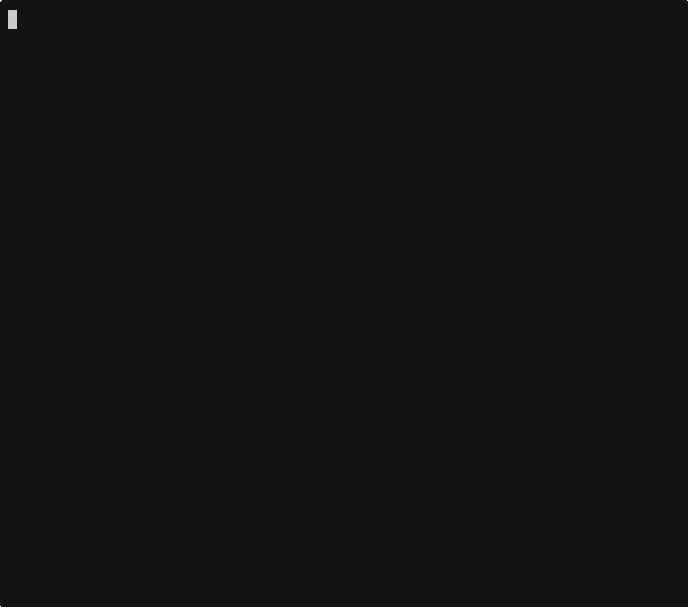

# nnav — Notes Navigator



> If you prefer taking notes in plain text or Markdown from the terminal, **nnav** makes it easy to browse and open them.

**nnav** is a fast, keyboard-driven **terminal UI (TUI)** for browsing your notes.
  
`nnav` scans your notes directory of plain-text or Markdown (`.txt`, `.md`) files and shows them in a collapsible tree.

The first Markdown heading (`# ...`) in each note is used as its description. If there is no Markdown heading, then the filename is displayed instead.

---

## ✨ Features

- Single binary, no dependencies
- Collapsible directory tree of your notes
- Supports `.md` and `.txt` files
- Shows the first Markdown heading as a description
- Vim-style keybindings (`h/j/k/l`, `q` to quit, etc.)
- Opens the selected note in your editor
- Config file at `~/.nnav` defines notes dir and editor:

```ini
notesdir=~/notes
editor=vim
```

- Create and organize your own tree of directories and plain text/Markdown notes. No databases, no proprietary formats, no vendor lock-in — just files you control

---

## ⌨️ Keybindings

| Key            | Action                           |
|----------------|----------------------------------|
| `↑` / `k`      | Move up                          |
| `↓` / `j`      | Move down                        |
| `→` / `l`      | Expand directory                 |
| `←` / `h`      | Collapse directory               |
| `Enter`        | Open note in your editor         |
| `r`            | Reload tree (re-scan notes dir)  |
| `q` / `Esc`    | Quit                             |

---

## 📦 Installation

### Option 1: Prebuilt packages (recommended)

Visit the [Releases page](https://github.com/brianmcjilton/nnav/releases/latest) and download the latest package for your system.

### Option 2: Build from source

---

## 🚀 Usage

After installing, just run:

    nnav

On first run, `~/.nnav` will be created with:
    notesdir=~/notes

Edit that file to point to your own notes directory.

---

## 🛠 Roadmap

- [ ] Search/filter notes (`/`)

---

## 🤝 Contributing

Please open an issue first if you’d like to discuss a major change.

---

## 📜 License

MIT © [Brian McJilton] (https://github.com/brianmcjilton)
